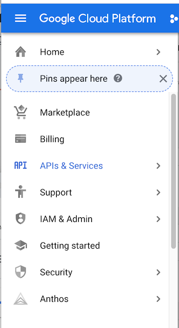
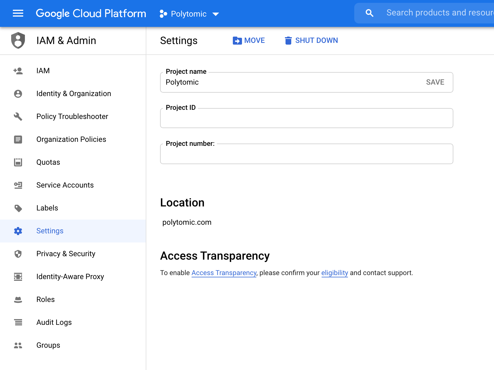
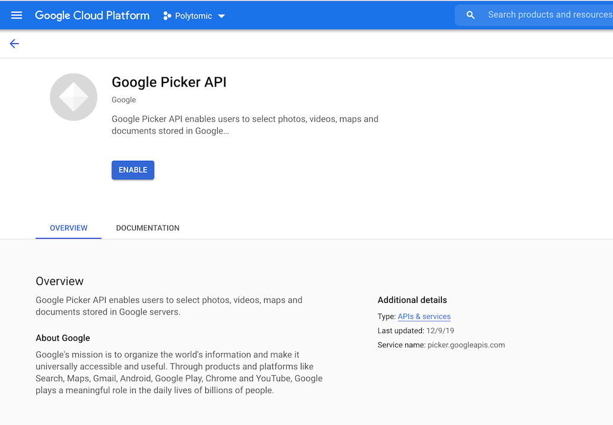
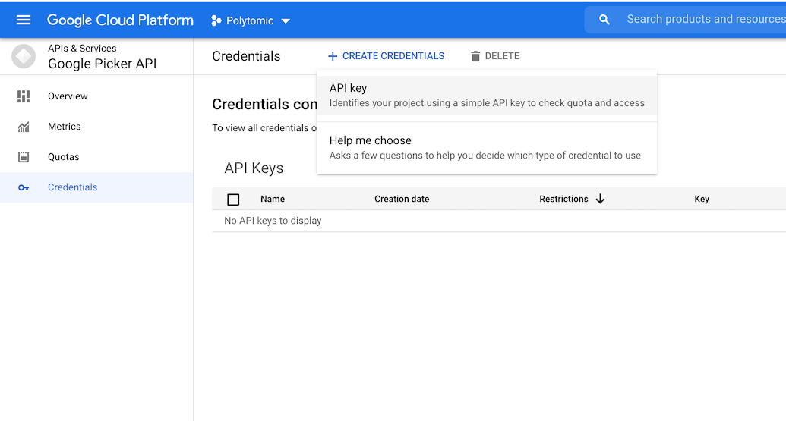
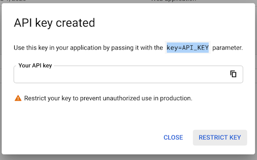
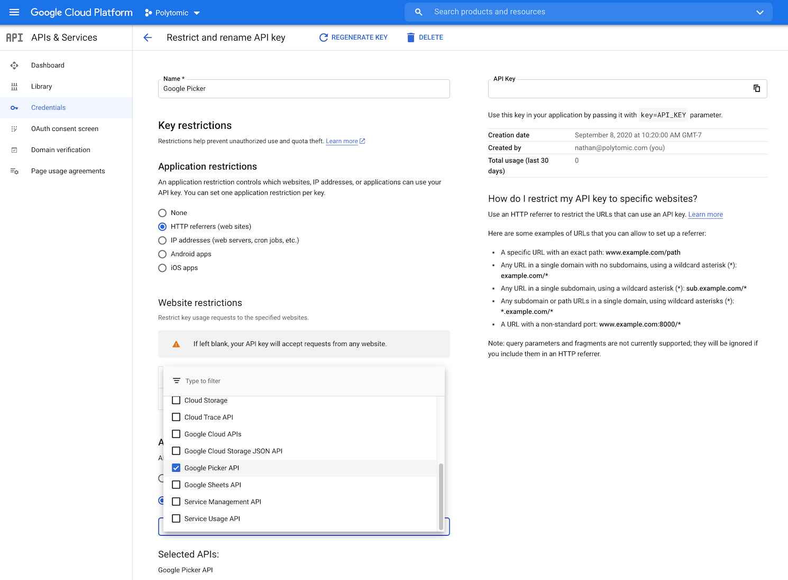

# Google Sheets

Configuring the Google Sheets integration for Polytomic allows you to
synchronize data from Google Sheets to your CRM.

## Configuration

Set the following environment variables if you plan to use Google Sheets connections:

- `GSHEETS_CLIENT_ID`, `GSHEETS_CLIENT_SECRET`
  Google OAuth Client ID and secret, obtained by creating a [OAuth 2.0 Client ID](https://console.developers.google.com/apis/credentials).

  The Google Drive API and Google Sheets API *must* be enabled for the associated project. See [Google Help](https://support.google.com/googleapi/answer/6158841?hl=en) for instructions on enabling APIs.

  Your valid redirect URLs _must_ include `{POLYTOMIC_URL}/connect/gsheets`.

- `GSHEETS_APP_ID`, `GSHEETS_API_KEY` Google App ID & API Key used for
  displaying the Google Sheets Picker when configuring a connection. See below
  for step-by-step instructions for generating these values.

### Finding the App ID

The Google Application ID is a numeric value associated with your Google Cloud project. To find the value, click the menu button in the upper left and select **IAM & Admin**.

The App ID is listed on the following page as the **Project Number**.

Set this value as `GSHEETS_APP_ID` in the Polytomic environment.

### Generating the API Key

1. Before you generate the API Key, you must enable the Google Picker API for your Project.

    

    You can find the Picker API by searching the Google API Library, or by
    [clicking
    here](https://console.cloud.google.com/apis/library/picker.googleapis.com).

2. After you enable the API, you'll be take to the list of valid credentials for
   the Picker API.

   

   Click the **+ Create Credentials** button, and select **API key**

3. Google will generate a new key for you to copy.

    

    Set this value as the `GSHEETS_API_KEY` in your Polytomic environment.

4. We recommend you place restrictions on this key in order to avoid abuse.

    Click **Restrict Key** to configure restrictions.

    

    You can restrict the key based on HTTP referrer, enabled APIs, or both.
