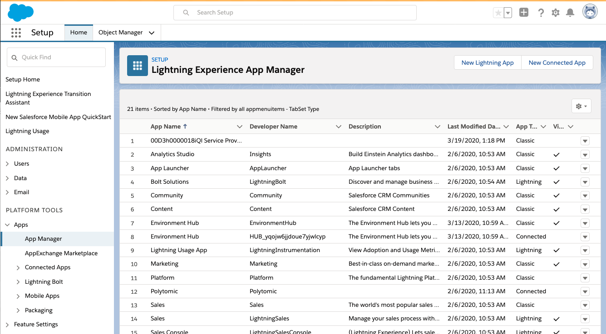
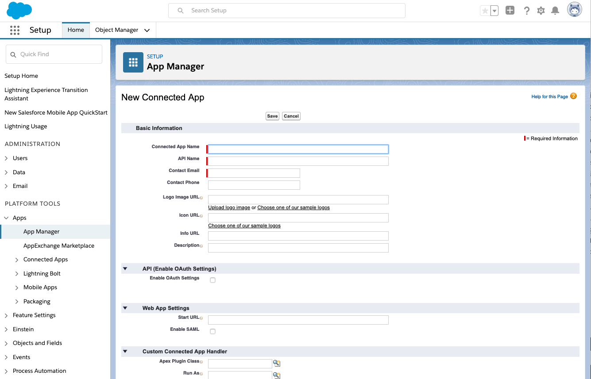
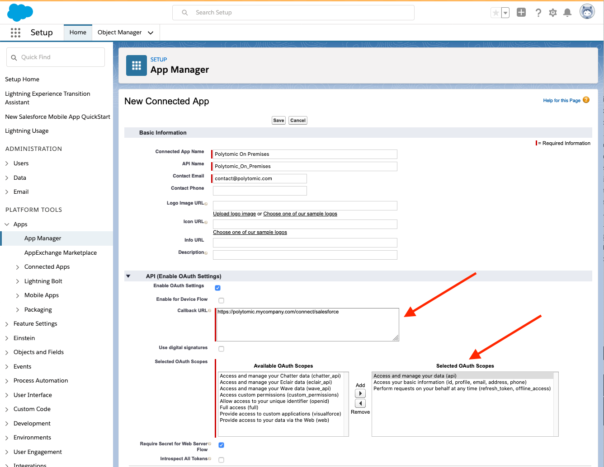

# Polytomic for Salesforce

In order to use Polytomic On Premises with Salesforce, you must configure the two systems to talk to one another. This involves two settings in the Salesforce Organization, and two environment variables for Polytomic.

## Create the Content Security Policy

A Content Security Policy allows the Polytomic widget to make HTTP requests from within Salesforce to your Polytomic installation.

You can find instructions for adding a CSP in the [Salesforce documentation](https://developer.salesforce.com/docs/atlas.en-us.lightning.meta/lightning/csp_trusted_sites.htm).

You should whitelist the following actions for your your installation:

* `connect-src`
* `frame-src`

## Create the Connected App

In order to connect Polytomic On Premises to Salesforce, you must create a Connected App in the Salesforce Console. A Connected App allows Polytomic to make a secure connection to Salesforce using OAuth.

To create a new Connected App, go to Setup in Salesforce and open the App Manager, located in Platform Tools.

Click "New Connected App" in the upper right, and provide a name and contact email for the app. The contact email should be one you control.

Check the *"Enable OAuth Settings"* to edit the connection settings.

The *Callback URL* will be a URL served by your Polytomic installation. In the initial setup, this was the `POLYTOMIC_URL` environment variable; the callback URL should be set to `<POLYTOMIC_URL>/connect/salesforce`.

The selected OAuth scopes must include the following:

- Access and manage your data (api)
- Access your basic information (id, profile, email, address, phone)
- Perform requests on your behalf at any time (refresh_token, offline_access)

Click *Save* and you'll be presented with the configured app. There are two details to capture here: the *consumer key* and *consumer secret*.

Set the following environment variables in your Polytomic installation:

- `SALESFORCE_CLIENT_ID` is set to the "Consumer Key" provided by Salesforce
- `SALESFORCE_CLIENT_SECRET` is set to the "Consumer Secret" provided by Salesforce
